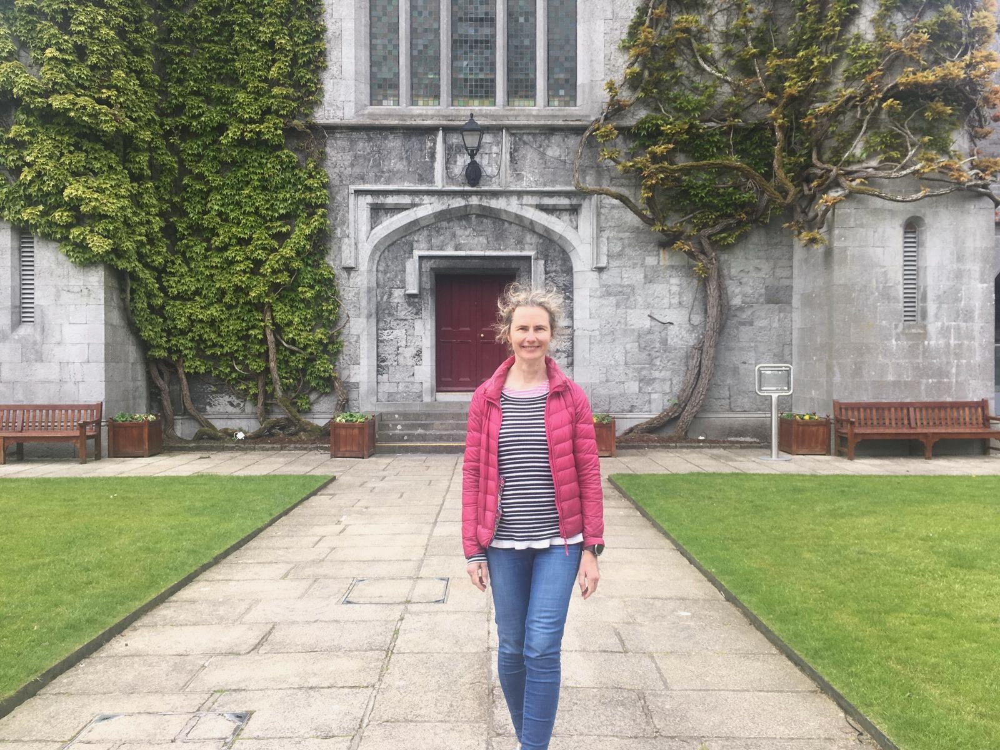

{width=330px}

---

I am a [Lecturer in Statistical Science](https://research.universityofgalway.ie/en/persons/nicola-fitz-simon/) in the [School of Mathematical and Statistical Sciences](https://www.universityofgalway.ie/science-engineering/school-of-maths/) at the [University of Galway](https://www.universityofgalway.ie).

My research interests include causal inference, small area estimation, and hierarchical modelling.  As an applied statistician, I collaborate with clinical and scientific researchers to address important scientific questions using real-world data.  My application areas include infectious disease, cardiovascular, environmental, and genetic epidemiology. 

I currently teach Statistics for Data Science, Statistical Learning and Prediction Modelling, and Causal Inference.  I am co-ordinator of the final year undergraduate projects in the School, and supervise both undergraduate and postgraduate theses.  

## Open PhD Position

**I welcome applications from suitably qualified candidates for a funded PhD in statistics focusing on causal inference and small area estimation.**

[PhD position description (PDF)](PhD_SAE_causal.pdf)

